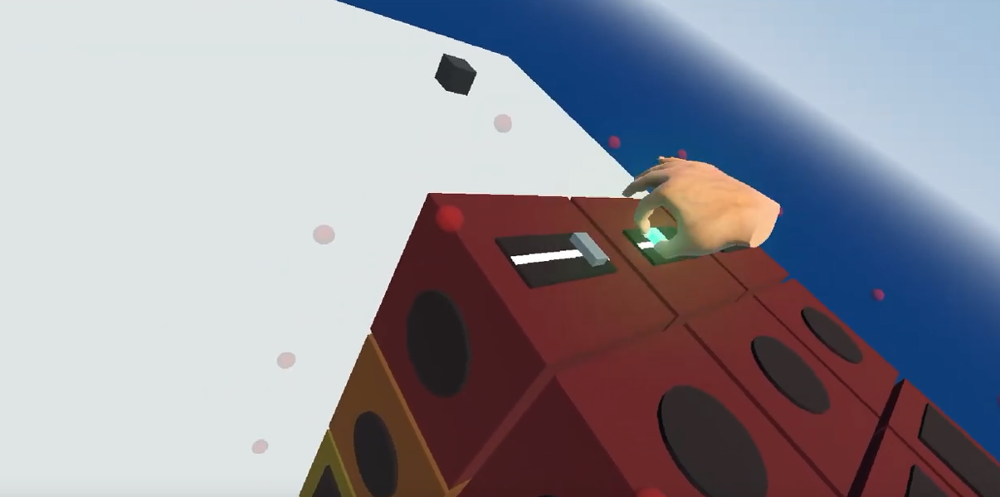
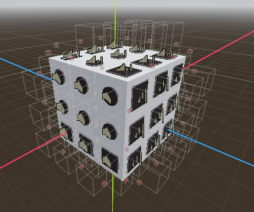

# Project Title

Name: Ben Corran

Student Number: C21430484

(https://www.youtube.com/watch?v=FtxhKLheXAk)

# Description of the project
This project consists of a fully interactable Rubiks Cube that takes the form of a musical sample pad. 
  Each face of every sub cube contains one of the following: 
- a beat pad for playing samplews
- a button for applying audio effects 
- a slider that generates a tone

# Instructions for use
### Rotating the cube 
Move your hand close to the floating red spheres and hold the grip button. Your hand movements will then rotate the face corresponding to that control surface.

### Playing samples and adding effects
Move your hand physically to hit the buttons. There is an area above the pads that alter your hand gesture to be a fist. 

### Generating tones
Move your hand close to the slider and hold the controlers grip. Moving your hand will then move the slider and will alter the tone generated by it.

### Changing volume
Pressing the back trigger button will toggle a wrist menu that has a volume slider that can be used with your right pointer. 

# How it works
The user grabs and is able to rotate 9 different rotation planes. When grabbed, whatever cubelets are intersecting with their areas are parented to that rotational plane, and as such and rotational movement is transfered to the cubelets themselves. 
 

# List of classes/assets in the project
| Scenes | Source |
|-----------|-----------|
| world.tscn | Self written  |
| interactable_cube.tscn | Self written |
| interactable_rotation_plane.tscn | Self written |
| cubelet.tscn | Self written |
| beat_pad.tscn | Self written |
| switch.tscn | Self written |
| theremin.tscn | Self written |
| pickable_object.tscn | Modfied From XRTools |
| xrOrigin.tscn | Modfied From XRTools |

| Scripts | Source |
|-----------|-----------|
| beat_pad.gd | Self written |
| cubelets.gd | Self written |
| interactable_cube.gd | Self written |
| interactable_rotation_planes.gd | Self written |
| switch.gd | Self written |
| switch_activation_area.gd | Self written |
| theremin.gd | Self written |
| world.gd | Self written |
| xr_origin.gd | Modfied From XRTools |
| interactable_hinge.gd | Modfied From XRTools |

# What I am most proud of in the assignment
I'm most proud of the Rubiks Cube itself and the fact that it functions as a physical one does

# What I learned
This assignment has taught me a huge amount about Godot and game development in general. Primarily on the fronts of audio sampling and generation and VR game development.

